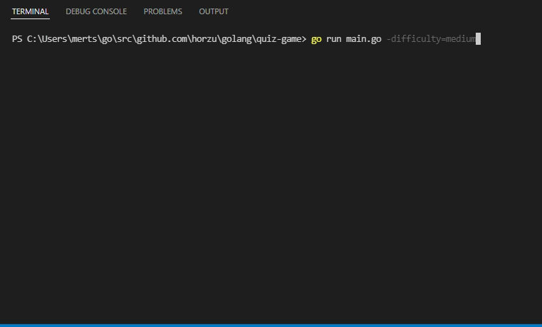
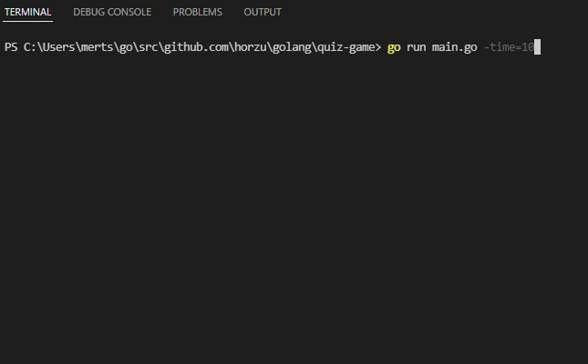
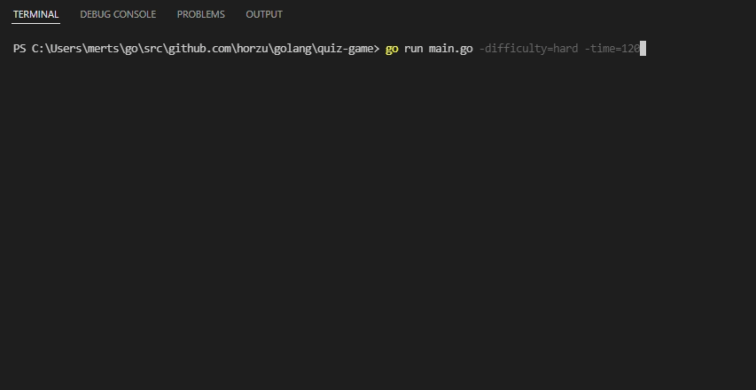

# Quiz App

A quiz app with timed math problems.

## Table of Contents

* [Setup](#setup)
* [Usage](#usage)
* [Screenshots](#screenshots)
* [Contact](#contact)
* [License](#license)

## Setup

To run this project you must have Golang installed in your PC.

## Usage

There are 3 different math problem sets as easy, medium and hard. You can select any difficulty with "-difficulty" flag.
You can also set a custom timer with "-time" flag.
You can set both if you want more customizable experiance.
Default parameter for difficulty is easy and default parameter for time limit is 30 seconds.

### difficulty flag

```go
go run main.go -difficulty=medium
```

### time flag

```go
go run main.go -time=40
```

### both flags

```go
go run main.go get -difficulty=hard time=120
```

## Screenshots

* "medium" flag



---

* "time" flag



---

* "both" flags



---

## Contact

Created by [@horzu](https://horzu.github.io/) - feel free to contact me!

## License

[MIT](https://choosealicense.com/licenses/mit/)
